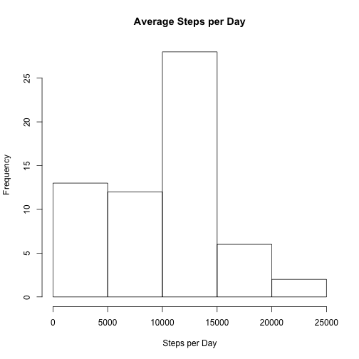
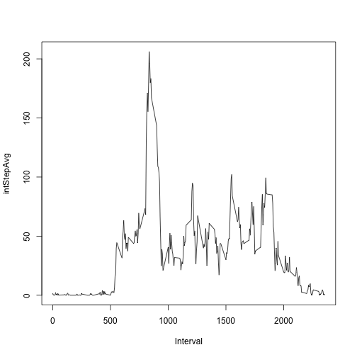
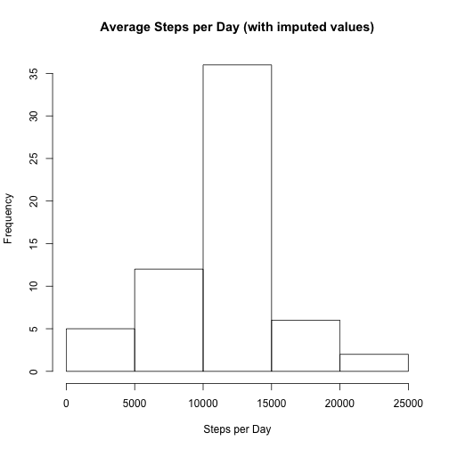
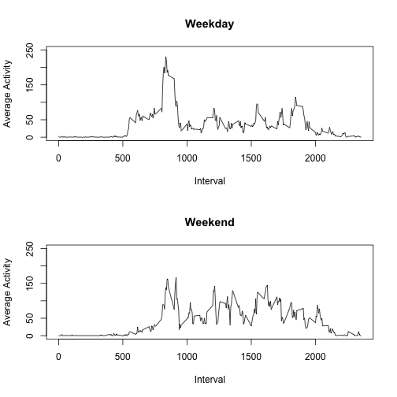

# Reproducible Research: Peer Assessment 1


## Loading and preprocessing the data

The first thing that we want to do is pull the data from teh course website,
unzip the file and import into R as a data table


```r
temp <- tempfile()

download.file(paste0("https://d396qusza40orc.cloudfront.net/", "repdata%2Fdata%2Factivity.zip"), 
    dest = temp, method = "curl")

unzip(temp, list = T)
```

```
##           Name Length                Date
## 1 activity.csv 350829 2014-02-11 10:08:00
```

```r

act <- read.csv(unz(temp, "activity.csv"))

unlink(temp)
```


## Finding the mean and median

Here we look at a histogram of the number of steps taken per day


```r
hist(with(act, tapply(steps, date, sum, na.rm = T)), xlab = "Steps per Day", 
    main = "Average Steps per Day")
```

 


We also want to find the mean and median values for steps taken per day.


```r
mean(with(act, tapply(steps, date, sum, na.rm = T)), na.rm = T)
```

```
## [1] 9354
```

```r
median(with(act, tapply(steps, date, sum, na.rm = T)), na.rm = T)
```

```
## [1] 10395
```


## What is the average daily activity pattern?

First we want to average the number of steps in each interval across all days
and plot the results.


```r
intStepAvg <- with(act, tapply(steps, interval, mean, na.rm = T))

plot(as.numeric(names(intStepAvg)), intStepAvg, type = "l", xlab = "Interval")
```

 

```r

max.int <- intStepAvg[intStepAvg == max(intStepAvg)]
```


It looks like the interval with the average greatest number of steps is the
835th interval with an average of 206.1698 steps.


## Imputing missing values

In order to get rid of missing value bias we will use a single imputation
method using the mean of that time period to impute the values.


```r
na.tot <- sum(is.na(act$steps))

actIm <- act

na.r <- is.na(act$steps)

actIm$steps[na.r] <- apply(actIm[na.r, ], 1, function(x) mean(actIm[actIm[, 
    3] == gsub(" ", "", x[3]), "steps"], na.rm = T))
```


It apperas the total number of rows with NA values is 2304.

We can create a new histogram...

```r
hist(with(actIm, tapply(steps, date, sum, na.rm = T)), xlab = "Steps per Day", 
    main = "Average Steps per Day (with imputed values)")
```

 


and check out the new mean and median


```r
mean(with(actIm, tapply(steps, date, sum, na.rm = T)), na.rm = T)
```

```
## [1] 10766
```

```r
median(with(actIm, tapply(steps, date, sum, na.rm = T)), na.rm = T)
```

```
## [1] 10766
```


Our mean and median have both shifted upwards now that we have imputed. This
probably means the values taht we were missing were intervals that had high 
average activty times.

## Are there differences in activity patterns between weekdays and weekends?

We are now going to examine the data and look for differences between weekdays
and weekends.


```r
actIm$weekday <- as.factor(grepl("S", weekdays(as.Date(actIm$date))))
levels(actIm$weekday) <- c("weekday", "weekend")
```


Here is a graph of that data showing the differences.

```r
par(mfrow = c(2, 1))

WDintSA <- with(subset(actIm, weekday == "weekday"), tapply(steps, interval, 
    mean, na.rm = T))

plot(as.numeric(names(WDintSA)), WDintSA, type = "l", xlab = "Interval", ylab = "Average Activity", 
    main = "Weekday", ylim = c(0, 250))

WEintSA <- with(subset(actIm, weekday == "weekend"), tapply(steps, interval, 
    mean, na.rm = T))

plot(as.numeric(names(WEintSA)), WEintSA, type = "l", xlab = "Interval", ylab = "Average Activity", 
    main = "Weekend", ylim = c(0, 250))
```

 

